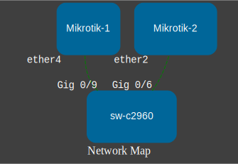

# net_topology
---

Script to build network map from cdp/lldp data.  

Script walks through devices in invevtory, run and collect cdp or lldp data to build network topology.  
Then uses `graphviz` module to build .svg file using topology data.  
By default image file is saved as `img/topology.svg`.  



##### script assumes that switch's name starts with `sw-` prefix (`sw-dc-2-asw-1`)

### Steps to run

Install required packages:  

```
sudo apt install -y python3-pip python3-venv
```

Clone theis repo:  

```
git clone https://github.com/saaverdo/net_topology.git -b cisco
```

Create python virtual environment (optional, but recommended):  

```
python3 -m venv venv
source venv/bin/activate
```

Install required python molules:  

```
pip install -r requirements.txt
```

Run script:  

```
python main.py -i inventory.yml -p 15 -proto lldp
```


